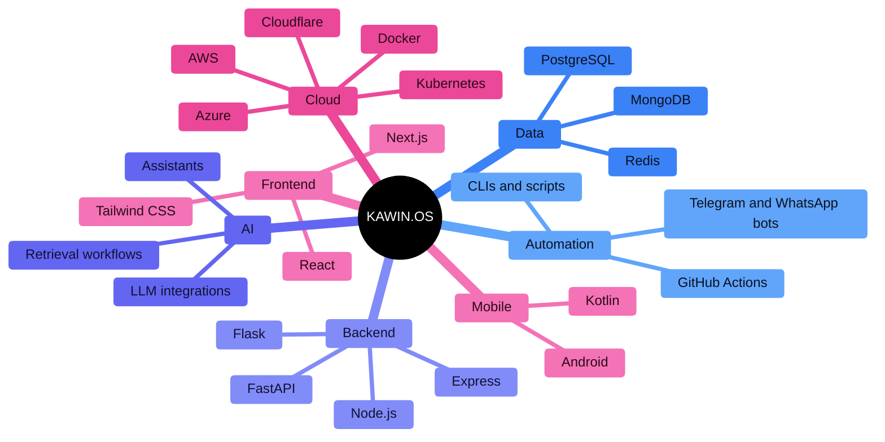
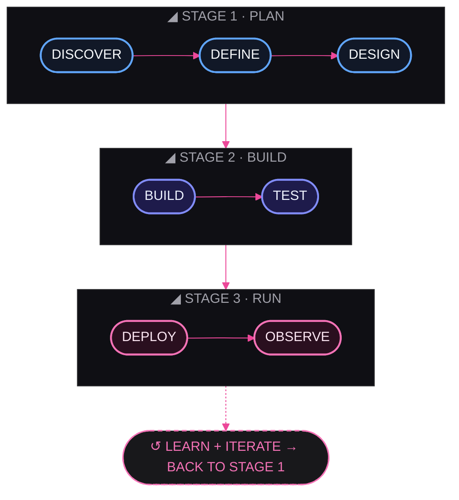
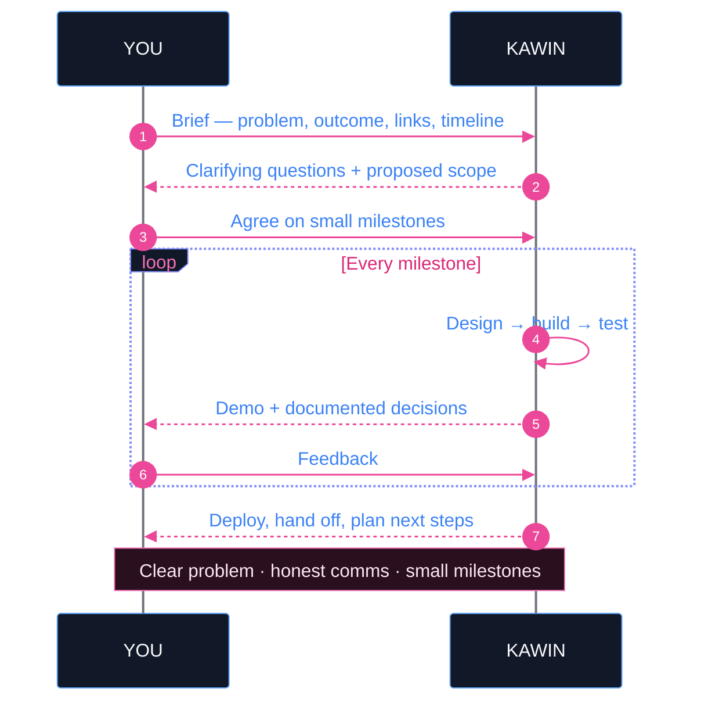

<!--
  ╔══════════════════════════════════════════════════════════════════════════╗
  ║  KAWIN.OS · GitHub profile README for P Kawin Raju                        ║
  ║  Accounts : kawincodes (primary) · kawinthedev (developer)                ║
  ║  Theme    : shadcn/ui + Material, blue & pink, Radix Icons                 ║
  ║  Assets   : ./assets/*.svg are generated - edit the CONTENT block in      ║
  ║             scripts/build_assets.py, then run:                            ║
  ║             python3 scripts/build_assets.py                               ║
  ╚══════════════════════════════════════════════════════════════════════════╝
-->

<a name="top"></a>

<a href="#whoami"></a>

<div align="center">

<a href="#mission-select"></a>

<a href="https://github.com/kawincodes"></a>
<br/>
<a href="https://github.com/kawincodes"></a>
<a href="https://github.com/kawinthedev"></a>
<a href="mailto:kawin@krstechsolutions.in"></a>

<sub><b>⌘ COMMAND DOCK</b> &nbsp;·&nbsp; select a module to jump straight to it</sub>

<a href="#whoami"></a>
<a href="#capabilities"></a>
<a href="#arsenal"></a>
<a href="#pipeline"></a>
<a href="#missions"></a>
<a href="#telemetry"></a>
<a href="#mission-select"></a>
<a href="#knowledge-base"></a>
<a href="#comms"></a>

</div>

<br/>

<!-- ═══════════════════════════════════════ 01 · WHOAMI ═══════════════════════════════════════ -->

<a name="whoami"></a>
<a href="#whoami"></a>

<a href="#mission-select"></a>

| ◢&nbsp;PARAMETER | VALUE |
|:--|:--|
| `NAME` | **P Kawin Raju** |
| `CLASS` | Full-Stack Developer · AI Builder · Cloud Enthusiast |
| `ROLES` | Full-Stack Developer · Backend & API Engineer · AI Solutions Builder · Cloud & Automation Enthusiast · SaaS Product Builder |
| `BASE` | India · IST (UTC+05:30) |
| `MISSION` | I turn practical ideas into dependable software products. |
| `MOTTO` | *Ship thoughtfully. Learn continuously. Improve relentlessly.* |
| `PRIMARY_NODE` | `@kawincodes` — primary public portfolio and contribution identity |
| `DEV_NODE` | `@kawinthedev` — additional developer account |
| `UPLINK` | `kawin@krstechsolutions.in` for projects & business · `kawinraju@gmail.com` for general communication |
| `STATUS` | 🟢 Open to thoughtful collaborations |

<details>
<summary><b>⟨/⟩ ALT VIEW — <code>profile.json</code></b> &nbsp;<sub>machine-readable identity</sub></summary>
<br/>

```json
{
  "profile": {
    "name": "P Kawin Raju",
    "location": "India",
    "timezone": "IST (UTC+05:30)",
    "headline": "Full-Stack Developer, AI Builder, and Cloud Enthusiast",
    "bio": "I turn practical ideas into dependable software products.",
    "motto": "Ship thoughtfully. Learn continuously. Improve relentlessly."
  },
  "github": {
    "primary": "https://github.com/kawincodes",
    "developer": "https://github.com/kawinthedev"
  },
  "contact": {
    "business": "kawin@krstechsolutions.in",
    "personal": "kawinraju@gmail.com",
    "preferred_for_projects": "business"
  },
  "roles": [
    "Full-Stack Developer",
    "Backend and API Engineer",
    "AI Solutions Builder",
    "Cloud and Automation Enthusiast",
    "SaaS Product Builder"
  ],
  "focus": [
    "Full-stack web products",
    "Scalable REST APIs",
    "AI and LLM integrations",
    "Developer tools and workflow automation",
    "Cloud-native and serverless applications",
    "Secure multi-tenant SaaS platforms"
  ],
  "technology": {
    "languages": ["Python", "TypeScript", "JavaScript", "Rust", "Kotlin", "PHP"],
    "frontend": ["React", "Next.js", "Tailwind CSS"],
    "backend": ["FastAPI", "Flask", "Node.js", "Express"],
    "data": ["PostgreSQL", "MongoDB", "Redis"],
    "cloud": ["AWS", "Azure", "Cloudflare", "Docker", "Kubernetes"],
    "mobile": ["Android (Kotlin)"],
    "ai_and_tools": ["OpenAI", "Git", "GitHub Actions", "Postman", "Linux"]
  },
  "currently_learning": [
    "Production AI agents and retrieval systems",
    "Rust backend development",
    "Kubernetes operations and observability",
    "Event-driven architecture",
    "Secure SaaS architecture"
  ],
  "engineering_principles": [
    "Clarity over cleverness",
    "Security by design",
    "Automate repeatable work",
    "Build observable systems",
    "Document decisions",
    "Measure outcomes and iterate"
  ],
  "availability": {
    "status": "Open to thoughtful collaborations",
    "options": [
      "Product and MVP development",
      "Backend and API engineering",
      "AI feature integration",
      "Automation and developer tooling",
      "Cloud and deployment improvements",
      "Architecture and code reviews",
      "Open-source collaboration"
    ]
  }
}
```

</details>

<details>
<summary><b>⎈ ALT VIEW — <code>kawin.yaml</code></b> &nbsp;<sub>the same engineer, as a Kubernetes manifest</sub></summary>
<br/>

```yaml
apiVersion: humans.dev/v1
kind: Engineer
metadata:
  name: p-kawin-raju
  namespace: india                      # IST · UTC+05:30
  labels:
    role: full-stack-developer
    focus: ai-cloud-automation
    status: open-to-collaborate
  annotations:
    github.com/primary: kawincodes
    github.com/developer: kawinthedev
    contact/projects: kawin@krstechsolutions.in
    contact/general: kawinraju@gmail.com
spec:
  replicas: 1                           # one of one
  mission: "I turn practical ideas into dependable software products."
  motto: "Ship thoughtfully. Learn continuously. Improve relentlessly."
  containers:
    - name: frontend
      image: kawin/frontend:react-nextjs-tailwind
    - name: backend
      image: kawin/backend:fastapi-flask-node-express
      ports:
        - name: rest-api
          containerPort: 443
    - name: data
      image: kawin/data:postgres-mongodb-redis
    - name: ai
      image: kawin/ai:llm-assistants-retrieval
    - name: cloud
      image: kawin/cloud:aws-azure-cloudflare-docker-k8s
    - name: automation
      image: kawin/automation:actions-bots-clis
    - name: mobile
      image: kawin/mobile:android-kotlin
  strategy:
    type: RollingUpdate                 # small milestones, continuous improvement
  readinessProbe:
    exec:
      command: ["ship", "--thoughtfully"]
  livenessProbe:
    exec:
      command: ["learn", "--continuously"]
status:
  phase: Running
  availability: Open to thoughtful collaborations
  conditions:
    - type: Learning
      status: "True"
      topics:
        - agents & retrieval
        - rust backends
        - kubernetes observability
        - event-driven systems
        - secure multi-tenant saas
```

</details>

<p align="right"><a href="#top"></a></p>

<!-- ═══════════════════════════════════════ 02 · CAPABILITIES ═══════════════════════════════════════ -->

<a name="capabilities"></a>
<a href="#capabilities"></a>

| MODULE | WHAT I BUILD | WHAT YOU GET |
|:--|:--|:--|
| 💻 **FULL-STACK PRODUCTS** | Responsive interfaces, dashboards, authentication and complete web applications | A working product, from interface to database |
| ⚙️ **BACKEND ENGINEERING** | REST APIs, integrations, background jobs, caching and data pipelines | Documented, testable services other systems can rely on |
| 🤖 **AI SOLUTIONS** | LLM features, assistants, retrieval workflows and intelligent automation | AI features grounded in a reliable application architecture |
| ☁️ **CLOUD DELIVERY** | Containerized services, serverless systems, CI/CD and observable deployments | Repeatable releases you can monitor |
| 🧩 **DEVELOPER TOOLS** | Telegram & WhatsApp bots, command-line tools, workflow automation and reusable internal platforms | Less manual work, fewer repeated steps |
| 📱 **ANDROID APPS** | Native Android apps written in Kotlin | Installable mobile tools for real workflows |
| 🔐 **SECURE SAAS** | Multi-tenant foundations, access control, validated APIs and safer defaults | Clear boundaries between tenants, data and operations |

<details open>
<summary><b>⚡ ENGINEERING DIRECTIVES</b> &nbsp;<sub>always enforced</sub></summary>
<br/>

```ts
// engineering.directives.ts — always enforced
export const directives = {
  clarity:  "over cleverness",
  security: "by design",
  automate: "repeatable work",
  feedback: "in small, fast loops",
  observe:  "every system that ships",
  document: "decisions, not just code",
  measure:  "outcomes, then iterate",
} as const;

// blocked at the gate
export const antiPatterns = [
  "clever-but-opaque abstractions",
  "security bolted on at the end",
  "manual, error-prone release steps",
  "shipping blind: no logs, metrics or traces",
  "decisions that live only in someone's head",
] as const;
```

</details>

<p align="right"><a href="#top"></a></p>

<!-- ═══════════════════════════════════════ 03 · ARSENAL ═══════════════════════════════════════ -->

<a name="arsenal"></a>
<a href="#arsenal"></a>

| LAYER | LOADOUT | DEPLOYED FOR |
|:--|:--|:--|
| **LANGUAGES** |       | APIs, automation, web apps and tooling — Rust for safe, efficient backends |
| **FRONTEND** |    | Responsive interfaces, dashboards and product UIs |
| **BACKEND** |     | REST APIs, integrations and background jobs |
| **DATA** |    | Relational and document storage, caching |
| **CLOUD & DEVOPS** |       | Containers, serverless, CI/CD and observable deployments |
| **AI** |    | Assistants, retrieval workflows, generation and classification |
| **MOBILE** |   | Native Android apps |
| **TOOLING** |      | Version control, API testing and Linux environments |

<details>
<summary><b>▦ ALT VIEW — brand icon grid</b> &nbsp;<sub>the same stack in each brand's own colours</sub></summary>
<br/>
<div align="center">

<sub><b>LANGUAGES</b></sub><br/>
<br/><br/>
<sub><b>FRONTEND · BACKEND</b></sub><br/>
<br/><br/>
<sub><b>DATA · CLOUD</b></sub><br/>
<br/><br/>
<sub><b>MOBILE · TOOLING</b></sub><br/>
<br/><br/>

</div>
</details>

<details>
<summary><b>◎ ALT VIEW — neural map</b> &nbsp;<sub>the stack as a mind map</sub></summary>
<br/>


```mermaid
%%{init: {'theme':'base', 'themeVariables': {'primaryColor':'#111827', 'primaryTextColor':'#F8FAFC', 'primaryBorderColor':'#60A5FA', 'lineColor':'#F472B6', 'cScale0':'#60A5FA', 'cScale1':'#F472B6', 'cScale2':'#818CF8', 'cScale3':'#3B82F6', 'cScale4':'#EC4899', 'cScale5':'#6366F1', 'cScale6':'#60A5FA', 'cScale7':'#F472B6', 'cScale8':'#818CF8', 'cScaleInv0':'#111827', 'cScaleInv1':'#2A0F1F', 'cScaleInv2':'#1E1B4B', 'cScaleInv3':'#111827', 'cScaleInv4':'#2A0F1F', 'cScaleInv5':'#1E1B4B', 'cScaleInv6':'#111827', 'cScaleInv7':'#2A0F1F', 'cScaleInv8':'#1E1B4B', 'cScaleLabel0':'#0B1020', 'cScaleLabel1':'#2A0A1A', 'cScaleLabel2':'#111133', 'cScaleLabel3':'#0B1020', 'cScaleLabel4':'#2A0A1A', 'cScaleLabel5':'#111133', 'cScaleLabel6':'#0B1020', 'cScaleLabel7':'#2A0A1A', 'cScaleLabel8':'#111133'}}}%%
mindmap
  root((KAWIN.OS))
    Frontend
      React
      Next.js
      Tailwind CSS
    Backend
      FastAPI
      Flask
      Node.js
      Express
    Data
      PostgreSQL
      MongoDB
      Redis
    Cloud
      AWS
      Azure
      Cloudflare
      Docker
      Kubernetes
    AI
      LLM integrations
      Assistants
      Retrieval workflows
    Automation
      GitHub Actions
      Telegram and WhatsApp bots
      CLIs and scripts
    Mobile
      Kotlin
      Android
```

</details>

<p align="right"><a href="#top"></a></p>

<!-- ═══════════════════════════════════════ 04 · PIPELINE ═══════════════════════════════════════ -->

<a name="pipeline"></a>
<a href="#pipeline"></a>


```mermaid
%%{init: {'theme':'base', 'themeVariables': {'fontSize':'15px', 'lineColor':'#EC4899', 'clusterBkg':'#0F0F14', 'clusterBorder':'#27272A', 'titleColor':'#A1A1AA'}}}%%
flowchart TB
    subgraph PLAN ["◢ STAGE 1 · PLAN"]
        direction LR
        D(["DISCOVER"]):::g --> F(["DEFINE"]):::g --> S(["DESIGN"]):::g
    end
    subgraph MAKE ["◢ STAGE 2 · BUILD"]
        direction LR
        B(["BUILD"]):::l --> T(["TEST"]):::l
    end
    subgraph RUN ["◢ STAGE 3 · RUN"]
        direction LR
        R(["DEPLOY"]):::a --> O(["OBSERVE"]):::a
    end
    PLAN --> MAKE --> RUN
    RUN -.-> L(["↺ LEARN + ITERATE → BACK TO STAGE 1"]):::loop
    classDef g fill:#111827,stroke:#60A5FA,stroke-width:2px,color:#F8FAFC
    classDef l fill:#1E1B4B,stroke:#818CF8,stroke-width:2px,color:#EEF2FF
    classDef a fill:#2A0F1F,stroke:#F472B6,stroke-width:2px,color:#FCE7F3
    classDef loop fill:#18181B,stroke:#F472B6,stroke-width:1.5px,stroke-dasharray:5 4,color:#F472B6
```

| # | PHASE | WHAT HAPPENS | OUTPUT |
|:-:|:--|:--|:--|
| `01` | **DISCOVER** | Find the real problem, the users and the constraints | Problem statement |
| `02` | **DEFINE** | Agree on the smallest useful outcome and the milestones | Scope & milestones |
| `03` | **DESIGN** | Shape the data model, APIs, UX and architecture | Diagrams & documented decisions |
| `04` | **BUILD** | Ship small, reviewable increments with quality and security built in | Working increments |
| `05` | **TEST** | Automated and manual checks against the expected behaviour | Green checks |
| `06` | **DEPLOY** | Repeatable, automated releases | A running service |
| `07` | **OBSERVE** | Logs, metrics, traces and user feedback | Insights that feed the next loop |

<p align="right"><a href="#top"></a></p>

<!-- ═══════════════════════════════════════ 05 · ACTIVE MISSIONS ═══════════════════════════════════════ -->

<a name="missions"></a>
<a href="#missions"></a>

<a href="#mission-select"></a>

<details>
<summary><b>▤ TEXT VIEW</b> &nbsp;<sub>the dashboard above, as plain text</sub></summary>
<br/>

| ACTIVE MISSION | OUTCOME |
|:--|:--|
| **AI-native products** | Useful AI features grounded in reliable application architecture |
| **SaaS foundations** | Secure multi-tenant systems with clear operational boundaries |
| **Platform automation** | Faster, repeatable builds, tests, deployments and maintenance |
| **Cloud-native engineering** | Resilient services that are observable and straightforward to operate |
| **Open-source learning** | Practical contributions, shared knowledge and stronger developer communities |

**Research queue — what I'm learning now**

- [ ] Production patterns for agents, retrieval, evaluation and guardrails
- [ ] Rust for safe and efficient backend development
- [ ] Kubernetes operations and cloud-native observability
- [ ] Event-driven architecture and real-time systems
- [ ] Secure multi-tenant SaaS design

</details>

<p align="right"><a href="#top"></a></p>

<!-- ═══════════════════════════════════════ 06 · TELEMETRY ═══════════════════════════════════════ -->

<a name="telemetry"></a>
<a href="#telemetry"></a>

<div align="center">


<a href="https://github.com/kawinthedev"></a>

<sub><b>PRIMARY NODE</b> <code>@kawincodes</code> &nbsp;◂ streaks ▸&nbsp; <code>@kawinthedev</code> <b>DEVELOPER NODE</b></sub>

</div>

<details>
<summary><b>▸ EXTENDED TELEMETRY</b> &nbsp;<sub>language breakdown by repository and by commit</sub></summary>
<br/>
<div align="center">


<br/>
<sub>Language colours are GitHub's standard language colours.</sub>
</div>
</details>

<div align="center">

<sub><b>⌁ REPO LAB</b> &nbsp;·&nbsp; browse public repositories by language</sub>

<a href="https://github.com/kawincodes?tab=repositories&language=python"></a>
<a href="https://github.com/kawincodes?tab=repositories&language=typescript"></a>
<a href="https://github.com/kawincodes?tab=repositories&language=javascript"></a>
<a href="https://github.com/kawincodes?tab=repositories&language=kotlin"></a>
<a href="https://github.com/kawincodes?tab=repositories&language=php"></a>
<a href="https://github.com/kawincodes?tab=repositories"></a>

</div>

<p align="right"><a href="#top"></a></p>

<!-- ═══════════════════════════════════════ 07 · MISSION SELECT ═══════════════════════════════════════ -->

<a name="mission-select"></a>
<a href="#mission-select"></a>

#### ◢ CHOOSE YOUR PATH

| IF YOU ARE… | YOU PROBABLY WANT | NEXT STEP |
|:--|:--|:--|
| 🚀 **A founder or client** with a product idea | `M01` Product / MVP · `M03` Backend / API · `M04` AI Integration | Hit a **LAUNCH** button below — it opens a ready-made brief |
| 💼 **A team or recruiter** hiring for product engineering | `02` Capabilities · `03` Arsenal · `06` Telemetry — one tap away in the command dock | Email `kawin@krstechsolutions.in` |
| ⌨️ **A developer or maintainer** | `M12` Open Source · `M09` Architecture Review · `M11` Developer Tooling | Browse the **REPO LAB** in `06` Telemetry, or launch the **OPEN SOURCE** brief |
| 👋 **Just exploring** | The story so far | Start at `01` WHOAMI, or say hello at `kawinraju@gmail.com` |

#### ◢ COLLABORATION MODULES

| CODE | MODULE | WHAT WE CAN BUILD OR IMPROVE | IDEAL STARTING INFO |
|:--|:--|:--|:--|
| `M01` | 🚀 **Product / MVP** | A complete product from interface to deployment | Users, core problem, must-have features, timeline |
| `M02` | 💻 **Frontend Experience** | Responsive websites, dashboards and product interfaces | Designs, brand direction, pages, integrations |
| `M03` | ⚙️ **Backend / API** | REST APIs, authentication, databases, jobs and caching | Endpoints, consumers, data model, performance needs |
| `M04` | 🤖 **AI Integration** | Assistants, RAG, generation, classification and AI workflows | Use case, source data, quality and safety expectations |
| `M05` | ⚡ **Automation** | Bots, scripts, CLIs, scheduled jobs and workflow integrations | Manual process, inputs, outputs, frequency |
| `M06` | ☁️ **Cloud / DevOps** | Containers, CI/CD, serverless delivery and observability | Current stack, environment, reliability goals |
| `M07` | 🔐 **Security Hardening** | API validation, access control, secrets and safer defaults | Architecture, threat concerns, existing controls |
| `M08` | 📈 **Performance Review** | Faster APIs, pages, database access and resource usage | Metrics, bottlenecks, traces, reproduction steps |
| `M09` | 🧭 **Architecture Review** | System boundaries, technology choices and growth planning | Diagram, requirements, constraints, expected scale |
| `M10` | 🧪 **API Testing** | Test strategy, Postman collections and integration checks | API definition, environments, expected behaviour |
| `M11` | 🛠️ **Developer Tooling** | Internal platforms, reusable tooling and better developer UX | Team workflow, recurring friction, target outcome |
| `M12` | 🧩 **Open Source** | Features, issue fixes, documentation and maintenance | Repository, issue, contribution guide, priorities |
| `M13` | 💬 **Technical Consultation** | Focused brainstorming and implementation planning | Context, decisions to make, desired next steps |

#### ◢ QUICK LAUNCH

<div align="center">

<sub>Each button opens an email with the subject and a short brief template already filled in.</sub>

<a href="mailto:kawin@krstechsolutions.in?subject=%5BMVP%5D%20Product%20/%20MVP%20inquiry&body=Hi%20Kawin%2C%0A%0AModule%3A%20M01%20Product%20/%20MVP%0AProblem%3A%20%0ADesired%20outcome%3A%20%0AUsers%3A%20%0AMust-haves%3A%20%0ALinks%3A%20%0ATimeline%3A%20%0A%0AThanks%21"></a>
<a href="mailto:kawin@krstechsolutions.in?subject=%5BAPI%5D%20Backend%20/%20API%20project&body=Hi%20Kawin%2C%0A%0AModule%3A%20M03%20Backend%20/%20API%0AProblem%3A%20%0ADesired%20outcome%3A%20%0AUsers%3A%20%0AMust-haves%3A%20%0ALinks%3A%20%0ATimeline%3A%20%0A%0AThanks%21"></a>
<a href="mailto:kawin@krstechsolutions.in?subject=%5BAI%5D%20AI%20integration%20project&body=Hi%20Kawin%2C%0A%0AModule%3A%20M04%20AI%20Integration%0AProblem%3A%20%0ADesired%20outcome%3A%20%0AUsers%3A%20%0AMust-haves%3A%20%0ALinks%3A%20%0ATimeline%3A%20%0A%0AThanks%21"></a>
<a href="mailto:kawin@krstechsolutions.in?subject=%5BAUTOMATION%5D%20Workflow%20automation&body=Hi%20Kawin%2C%0A%0AModule%3A%20M05%20Automation%0AProblem%3A%20%0ADesired%20outcome%3A%20%0AUsers%3A%20%0AMust-haves%3A%20%0ALinks%3A%20%0ATimeline%3A%20%0A%0AThanks%21"></a>
<a href="mailto:kawin@krstechsolutions.in?subject=%5BCLOUD%5D%20Cloud%20/%20DevOps%20project&body=Hi%20Kawin%2C%0A%0AModule%3A%20M06%20Cloud%20/%20DevOps%0AProblem%3A%20%0ADesired%20outcome%3A%20%0AUsers%3A%20%0AMust-haves%3A%20%0ALinks%3A%20%0ATimeline%3A%20%0A%0AThanks%21"></a>
<a href="mailto:kawin@krstechsolutions.in?subject=%5BREVIEW%5D%20Architecture%20review&body=Hi%20Kawin%2C%0A%0AModule%3A%20M09%20Architecture%20Review%0AProblem%3A%20%0ADesired%20outcome%3A%20%0AUsers%3A%20%0AMust-haves%3A%20%0ALinks%3A%20%0ATimeline%3A%20%0A%0AThanks%21"></a>
<a href="mailto:kawin@krstechsolutions.in?subject=%5BOSS%5D%20Open-source%20collaboration&body=Hi%20Kawin%2C%0A%0AModule%3A%20M12%20Open%20Source%0AProblem%3A%20%0ADesired%20outcome%3A%20%0AUsers%3A%20%0AMust-haves%3A%20%0ALinks%3A%20%0ATimeline%3A%20%0A%0AThanks%21"></a>
<a href="mailto:kawinraju@gmail.com?subject=Hello%20from%20your%20GitHub%20profile"></a>

</div>

#### ◢ ENGAGEMENT PROTOCOL


```mermaid
%%{init: {'theme':'base', 'themeVariables': {'actorBkg':'#111827', 'actorBorder':'#60A5FA', 'actorTextColor':'#F8FAFC', 'actorLineColor':'#71717A', 'signalColor':'#EC4899', 'signalTextColor':'#3B82F6', 'labelBoxBkgColor':'#111827', 'labelBoxBorderColor':'#818CF8', 'labelTextColor':'#F472B6', 'loopTextColor':'#DB2777', 'noteBkgColor':'#2A0F1F', 'noteBorderColor':'#F472B6', 'noteTextColor':'#FCE7F3', 'activationBkgColor':'#1E1B4B', 'activationBorderColor':'#818CF8', 'sequenceNumberColor':'#FFFFFF'}}}%%
sequenceDiagram
    autonumber
    participant Y as YOU
    participant K as KAWIN
    Y->>K: Brief — problem, outcome, links, timeline
    K-->>Y: Clarifying questions + proposed scope
    Y->>K: Agree on small milestones
    loop Every milestone
        K->>K: Design → build → test
        K-->>Y: Demo + documented decisions
        Y->>K: Feedback
    end
    K-->>Y: Deploy, hand off, plan next steps
    Note over Y,K: Clear problem · honest comms · small milestones
```

#### ◢ BRIEF TEMPLATE

```text
┌─ PROJECT BRIEF ──────────────────────────────────────────────┐
│ MODULE ......... M01–M13 (see the table above)               │
│ PROBLEM ........ what hurts today?                           │
│ OUTCOME ........ what does success look like?                │
│ USERS .......... who is it for?                              │
│ MUST-HAVES ..... the non-negotiables                         │
│ LINKS .......... designs, repos, docs, demos                 │
│ TIMELINE ....... preferred start and deadline                │
└──────────────────────────────── → kawin@krstechsolutions.in ─┘
```

> [!NOTE]
> **What makes a good collaboration:** a clear problem, honest communication, small milestones, documented decisions, and a shared commitment to delivering something genuinely useful.

<p align="right"><a href="#top"></a></p>

<!-- ═══════════════════════════════════════ 08 · KNOWLEDGE BASE ═══════════════════════════════════════ -->

<a name="knowledge-base"></a>
<a href="#knowledge-base"></a>

<details>
<summary><b>❯ Why two GitHub accounts?</b></summary>
<br/>

- `kawincodes` is my primary public portfolio and contribution identity.
- `kawinthedev` is my additional developer account.

</details>

<details>
<summary><b>❯ What opportunities am I open to?</b></summary>
<br/>

Product engineering, full-stack development, backend APIs, AI integrations, developer tooling, cloud automation, and meaningful open-source collaboration.

</details>

<details>
<summary><b>❯ How should you contact me?</b></summary>
<br/>

Use `kawin@krstechsolutions.in` for project and business conversations. Use `kawinraju@gmail.com` for general communication.

</details>

<details>
<summary><b>❯ What should a first message include?</b></summary>
<br/>

A short description of the problem, the desired outcome, relevant links and your preferred timeline. Adding a module code (`M01`–`M13`) from **Mission Select** helps route it — or just press one of the **LAUNCH** buttons, which pre-fill all of this for you.

</details>

<details>
<summary><b>❯ What makes a good collaboration?</b></summary>
<br/>

A clear problem, honest communication, small milestones, documented decisions, and a shared commitment to delivering something genuinely useful.

</details>

<details>
<summary><b>❯ What am I learning right now?</b></summary>
<br/>

- Production patterns for agents, retrieval, evaluation and guardrails
- Rust for safe and efficient backend development
- Kubernetes operations and cloud-native observability
- Event-driven architecture and real-time systems
- Secure multi-tenant SaaS design

</details>

<details>
<summary><b>❯ Which timezone am I in?</b></summary>
<br/>

India Standard Time — **IST, UTC+05:30**.

</details>

<details>
<summary><b>❯ How is this profile built?</b></summary>
<br/>

- **Animated panels** (hero, terminal, status board, section headers, footer) are hand-built SVGs with CSS and SMIL animation, generated by `scripts/build_assets.py` — pure Python, no dependencies. They respect `prefers-reduced-motion`, and every panel carries its own HUD background, so it looks the same in GitHub's light and dark themes.
- **Live data** comes from GitHub Profile Summary Cards, GitHub Readme Streak Stats, Skill Icons, shields.io and the komarev profile-views counter.
- **Diagrams** are native GitHub Mermaid blocks.

</details>

<p align="right"><a href="#top"></a></p>

<!-- ═══════════════════════════════════════ 09 · COMMS ═══════════════════════════════════════ -->

<a name="comms"></a>
<a href="#comms"></a>

| CHANNEL | ADDRESS | BEST FOR |
|:--|:--|:--|
| 💼 **Business · projects** | `kawin@krstechsolutions.in` | Projects, proposals and business conversations — *preferred for projects* |
| ✉️ **Personal** | `kawinraju@gmail.com` | General communication |
| ⌨️ **GitHub · primary** | `@kawincodes` | Portfolio, code and contributions |
| 🧪 **GitHub · developer** | `@kawinthedev` | Additional developer account |

<div align="center">

<a href="mailto:kawin@krstechsolutions.in"></a>
<a href="mailto:kawinraju@gmail.com"></a>
<br/>
<a href="https://github.com/kawincodes"></a>
<a href="https://github.com/kawinthedev"></a>

</div>

<br/>

<a href="#top"></a>

<div align="center">
<sub>Designed and maintained by <b>P Kawin Raju</b> · KAWIN.OS · 2026</sub>
</div>
